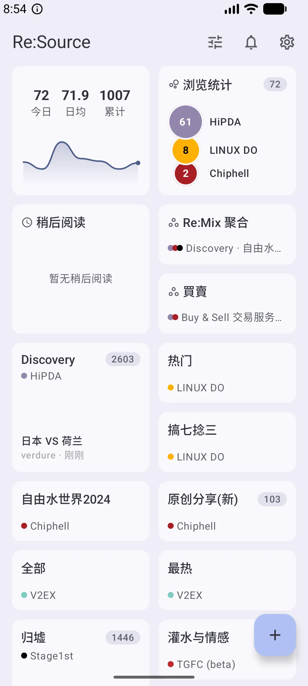
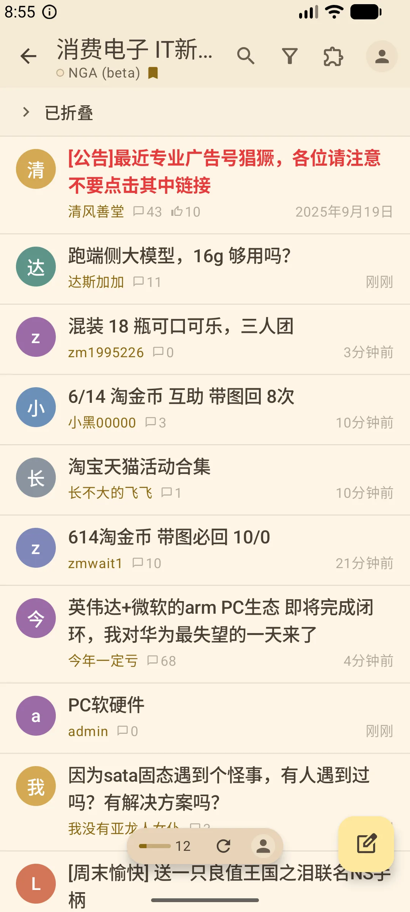
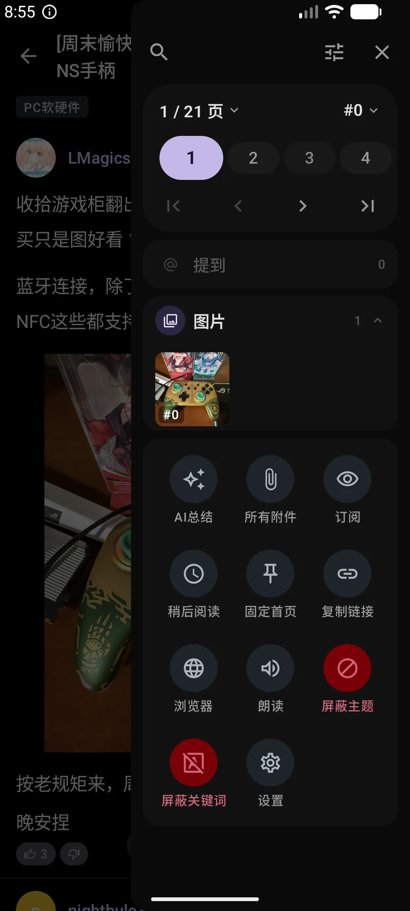
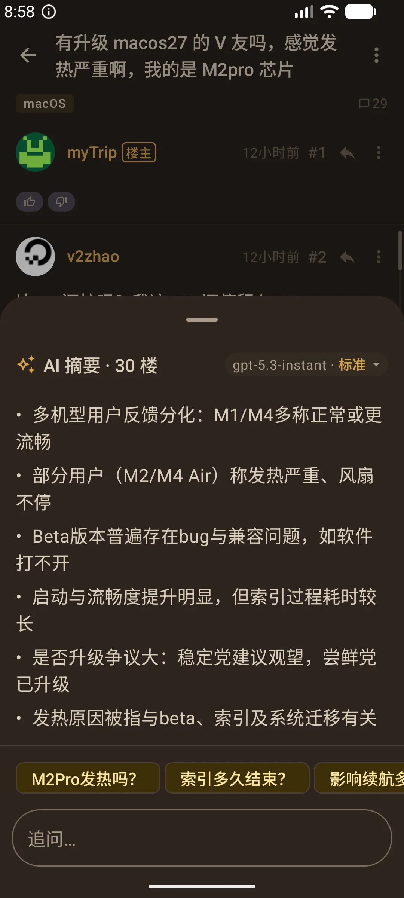
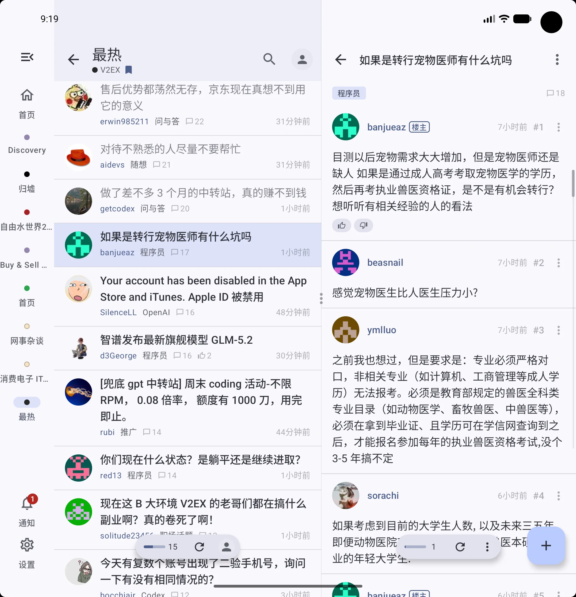
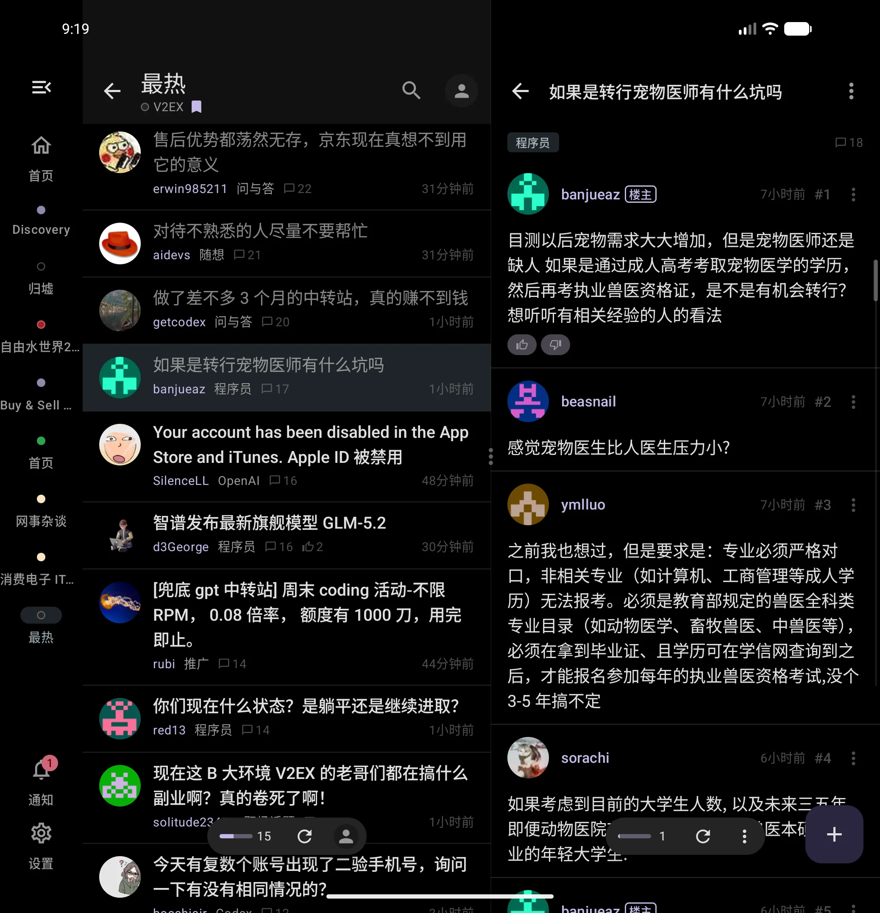
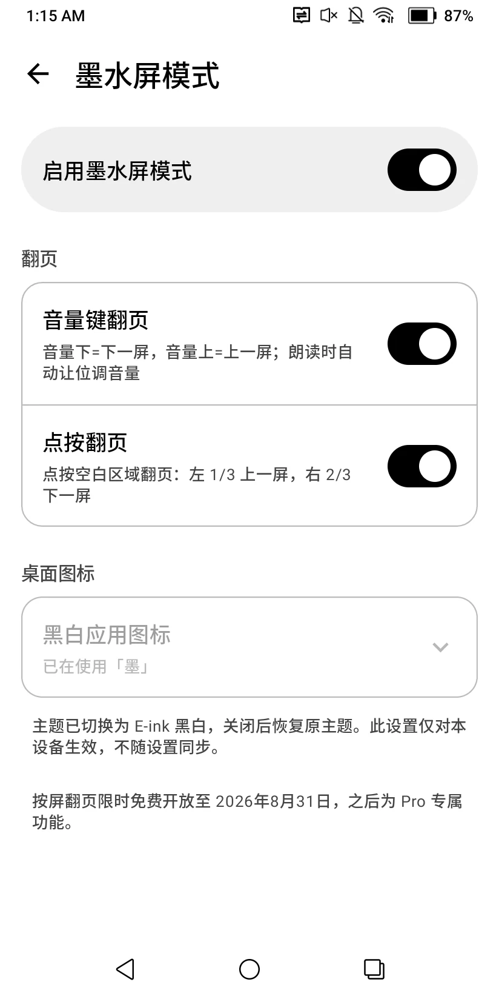
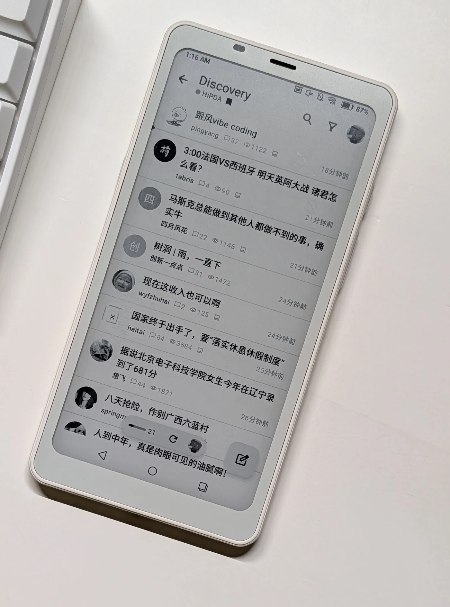

  

<h1 align="center">Re:Source</h1>

  <strong>经典论坛，现代体验</strong> 
  把你常逛的中文论坛装进一个原生 Android 客户端 · 不套壳、不卡顿，专注内容本身

  
  
  
  

  
  
  
  

  
  

  
  

  <em>19 个论坛 · 9 套内置主题 + 自定义主题编辑器 · 动态取色 · 平板 / 折叠屏分栏 · 墨水屏模式</em>

---

## 已接入论坛

| 论坛 | 说明 | 状态 |
|:-----|:-----|:----:|
|  | 专门网 | ✅ |
|  | 精品技术论坛 | ✅ |
|  | 分享与交流用户体验 | ✅ |
|  | 4D4Y 论坛 | ✅ |
|  | 台湾科技论坛 | ✅ |
|  | 精英玩家俱乐部 | ✅ |
|  | VPS 与服务端社区 | ✅ |
|  | 游戏动漫论坛 | ✅ |
|  | 分享宅生活 | ✅ |
|  | 创意工作者们的社区 | ✅ |
|  | 一亩三分地 · 北美留学申请与求职 | 🧪 |
|  | 吾爱破解 · 软件安全与逆向工程 | 🧪 |
|  | 蜂鸟摄影论坛 | 🧪 |
|  | 飞客茶馆 · 常旅客与信用卡 | 🧪 |
|  | 虎扑 · 步行街与体育社区 | ⚠️ |
|  | 宽带山 · 在这里・看上海 | 🧪 |
|  | Where possible begins | 🧪 |
|  | 恩山无线 · 路由器与智能设备社区 | 🧪 |
|  | 色影无忌 · 无忌摄影论坛 | 🧪 |
| 更多论坛 | 持续接入中… | 🔜 |

✅ 稳定 · 🧪 测试版 · ⚠️ 目前仅支持只读浏览 · 🔜 即将接入

---

## 功能亮点

- **零 WebView，纯原生渲染** — 100% Jetpack Compose 构建，每一帧都是原生性能
- **续读** — 统一标记「上次读到」的位置并显示新增回复数，一键接着看；已读状态跨设备同步
- **板块订阅 · 自定义首页** — 自由组合你关注的板块，打造属于你的论坛首页
- **Re:Mix 聚合** — 多坛板块混合成一个信息流，一屏刷完，不再反复横跳
- **关注用户 · 通知历史** — 关注感兴趣的人，新帖动态集中追看；全部账号的通知自动归档，可搜索回看，保留 90 天
- **讨论视图** — 从引用进入完整回复树，双向追溯上下文，分支可折叠
- **朗读** — 逐楼语音朗读，支持后台播放与锁屏控制，迷你播放器可点击跳转、自动滚动、调节语速与语音
- **AI 助手** — 摘要（可点击跳转的楼层引用）、排版、划词解释、追问；可自带密钥直连 Anthropic、Gemini、Qwen、GLM、Kimi 等服务商
- **快捷胶囊** — 悬浮胶囊支持四向滑动 + 长按，五个手势位各可绑定十余种动作，单手掌控；元素可自由增减排序
- **主题引擎** — 支持 Material You 动态取色，9 套内置主题，另有色板 / JSON 双模式的自定义主题编辑器，可导入导出 `.resource-theme` 并跨设备同步：
  
  
  
  
  
  
  
  
  
   Catppuccin 两款为 Pro 专属
- **平板 & 折叠屏** — 大屏分栏浏览，分屏宽度可拖动调整
- **墨水屏模式** — 为电子墨水屏优化：音量键 / 点按整屏翻页、专属黑白主题与图标、动图冻结、动画即时化
- **发帖与图片管理** — 图片进入独立图片栏并获固定编号，点按插入正文；多选插入 / 移除、拖动排序、粘贴上传与失败重试；编辑时可管理帖内已有图片
- **导出卡片** — 一键生成分享卡片，BBS、杂志、便签、宝丽来、引用、贴纸墙等多种版式与配色，支持自定义字体与纸张纹理
- **屏蔽管理** — 用户、帖子、关键词三类屏蔽集中管理，关键词支持多词组合、按论坛限定范围与有效期
- **云同步** — WebDAV 备份与跨设备同步，加密存储，账号自动匹配
- **桌面小组件** — 稍后阅读、最近阅读、收藏、私信与浏览统计直接放上桌面
- **多账号** — 每个论坛可添加多个账号，随时切换
- **简体 / 繁体中文** — 设置中随时切换

更多：稍后再读 · 固定帖子 · 特别备注 · 成员数据 · 帖内侧栏与提及面板 · 引用链 · 边缘楼层拖动条 · 查看全部图片 / 附件 · Markdown 渲染 · 表格渲染 · 每日签到 · 私信 · 站内 / Google 双搜索源

---

## 免费 vs Pro

| 功能 | 免费 | Pro |
|:-----|:----:|:---:|
| 全部论坛 · 浏览 / 发帖 / 通知 | ✅ | ✅ |
| 续读与跨设备已读同步 | ✅ | ✅ |
| 板块订阅 · 自定义首页 | ✅ | ✅ |
| 内置主题（含动态取色） | ✅ | ✅ |
| 快捷胶囊与手势 | ✅ | ✅ |
| 讨论视图 · 引用链 · 提及面板 | ✅ | ✅ |
| 通知历史（90 天） | ✅ | ✅ |
| 屏蔽管理（用户 / 帖子 / 关键词） | ✅ | ✅ |
| 云同步（WebDAV） | ✅ | ✅ |
| AI 摘要 · AI 排版 · 划词解释 | ✅ | ✅ |
| 导出卡片 | ✅ | 更多版式 · 可去水印 |
| 平板 & 折叠屏分栏 | ✅ | ✅ |
| 特别备注 | 10 个 | 无限 |
| 稍后再读 | 10 个 | 无限 |
| 固定帖子 | 5 个 | 无限 |
| 关注用户 | 5 个 | 无限 |
| Re:Mix 聚合 | 1 个 | 无限 |
| 每个论坛的账号数 | 2 个 | 无限 |
| 自定义主题 | 1 个 | 无限 + Catppuccin |
| 自定义小尾巴 | 1 条 · 2 行 | 3 条 · 5 行 |
| 应用图标 | 4 款 | 全部专属图标 |
| 查看帖子全部图片 | — | ✅ |
| 连续朗读（自动翻页） | — | ✅ |
| 桌面小组件 | — | ✅ |
| 墨水屏整屏翻页 | 限免至 2026/8/31 | ✅ |
| **价格** | **免费** | **¥8/月 或 ¥68/年** |

---

## 获取 Pro

两种方式，任选其一：

- **Google Play 订阅** — 应用内直接订阅，自动续费
- **爱发电** — 在爱发电支持后用订单号兑换 Pro，支持多设备管理与自动恢复 ☕

  

---

## 用户怎么说

> **"神作"** — 王世壮 · Google Play ★★★★★

> **"因为这个 app 我又重返 Chiphell。"** — dearbox · Chiphell

> **"顶一个，正在用，感觉上目前排第一的客户端。"** — coolblood · HiPDA

> **"做的真的很漂亮！界面直接吸取了系统配色，放到桌面图标原生匹配主题。"** — loveless21 · HiPDA

> **"加载速度快，自选板块，不臃肿，浏览丝滑顺畅。"** — 2eggs wong · Google Play ★★★★★

> **"越來越棒，真的很好用。我喜歡樓主的設計，淡淡的色調和比較小的字體。"** — 马听唱 · HiPDA

> **"多论坛板块的组合浏览真的非常好的体验…"** — 能蟹仔 · Google Play ★★★★★

> **"感觉页面载入速度比其他客户端快，这个就很爽了！"** — flysea · HiPDA

> **"有点厉害，初版的功能就很完善。首页信息流的展示方式很棒诶。"** — ZBY901026 · Stage1st

> **"需要横跳两大论坛 app 的人在大神的尽心呵护下，越来越圆满了。"** — leigoo · Chiphell

> **"越来越棒了，进一步增强了我打开论坛 app 的频率和遨游其中的畅快感觉。"** — 疯狂公路 · HiPDA

> **"用了一下还挺好用，谢谢大佬。四方向可拉确实很好用，设置成翻页很方便。"** — trentswd · Stage1st

---

## 下载

- [Google Play](https://play.google.com/store/apps/details?id=io.lv1.resource)
- [GitHub Releases (APK)](https://github.com/kenischu/ReSource/releases)

免费下载 · 无广告 · Pro 可选 · Android 8.0+

---

Lovingly made in Macau ❤️ By Kenis

